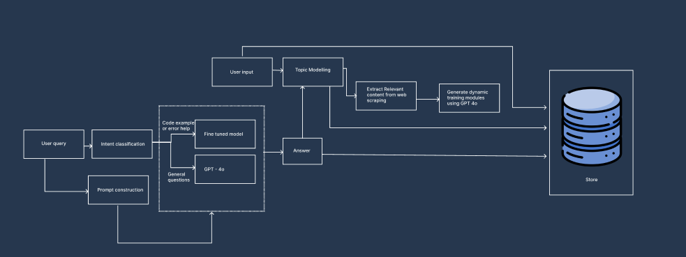

# 💡 CodeSensei: Code Assistance Chatbot Incorporating Intelligent Query Classification

_Group 14: CHUA KHIONG JIAN, POH YONG QUAN, SASIPRIYA AYYANAN, TONG CHANG_

---

## 🚀 Overview

**CodeSensei** is an intelligent, interactive coding assistant chatbot designed to enhance programming education through real-time feedback, contextual query understanding, and dynamic module generation. It leverages fine-tuned language models and intelligent query classification to deliver tailored support, especially for code debugging, conceptual understanding, and best practice guidance.

---

## 🧠 Key Features

- **Intent Classification** – Categorize user queries using TF-IDF or fine-tuned transformers.
- **Prompt Conditioning** – Steer model responses with intent-specific prompts.
- **Fine-Tuned Code Model** – LoRA-fine-tuned Phi-2 for low-latency code generation.
- **Web Augmentation** – Use Serper API to fetch real-time external content.
- **Interactive Modules** – Generate self-contained HTML/JS quizzes and code editors.
- **Query Logging** – Log and analyze queries for personalization and improvement.

---
## 🏗️ System Architecture



This diagram illustrates the flow from user query to intelligent intent classification, routing through the appropriate model, storing results, and generating dynamic interactive modules.

---

## 📚 Datasets Used

- [Stack Overflow Posts](https://huggingface.co/datasets/mikex86/stackoverflow-posts)
- [StackSample](https://www.kaggle.com/datasets/stackoverflow/stacksample)
- [pacovaldez/stackoverflow-questions](https://huggingface.co/datasets/pacovaldez/stackoverflow-questions)
- [60k Stack Overflow Questions with Quality Rating](https://www.kaggle.com/datasets/imoore/60k-stack-overflow-questions-with-quality-rate)
- [CS1QA](https://github.com/cyoon47/CS1QA)
- Self-generated data from AWS PartyRock (Claude 3.5) https://www.kaggle.com/datasets/sasipriyaayyanan/intent-classification-for-code-tutor-chatbot

---

<!-- Canvas Notice: You can view this installation guide file in the Canvas sidebar under 'Installation' -->
# 🛠️ Installation Guide

Follow these steps to set up and run the CodeSensei chatbot locally.

## Prerequisites

- Python 3.10+
- Git
- [Conda](https://docs.conda.io/) or optional [venv](https://docs.python.org/3/library/venv.html)

## Steps

### 1. Clone the Repository
```bash
git clone https://github.com/sassssyy04/PLP.git
cd PLP
```

### 2. Create and Activate Python Environment

**Using Conda (Recommended):**
```bash
conda create --name plpenv python=3.10 -y
conda activate plpenv
```

**Using venv (Alternative):**
```bash
python3 -m venv plpenv

# macOS/Linux
source plpenv/bin/activate

# Windows (PowerShell)
.\plpenv\Scripts\Activate.ps1
```

### 3. Install Dependencies
```bash
pip install --upgrade pip
pip install -r requirements.txt
```

### 4. Set Up Environment Variables
Create a `.env` file in the project root and add:
```dotenv
OPENAI_API_KEY=<your_openai_api_key>
SERPER_API_KEY =<your_serper_api_key>
```

### 6. Run the Application
```bash
python app.py
```
The application will be available at: `http://localhost:5000`

### 7. Open in Browser
Navigate to `http://localhost:5000` in your web browser.

---

💡 **Note:** Ensure all model files and environment variables are correctly set up before running the app.


## 🔍 Evaluation Summary
✅ Intent Classification (Best: DistilBERT + CS1QA)
Accuracy: 0.75

Precision / Recall / F1: 0.75

✅ MLM Fine-Tuning (Perplexity Reduced)
DistilBERT: 26.54 → 3.20

RoBERTa: 7.78 → 4.15

CodeBERT: 14.73 → 6.74

✅ Code Generation (Phi-2)
Fine-tuned Phi-2 outperformed base model in >65% of GPT-4o-judged completions.

## 🧰 Tech Stack
Component	Tool/Library
Backend	Flask
ML Framework	HuggingFace Transformers, PEFT
LLMs	Phi-2, GPT-4o, Claude 3.5
Frontend Modules	HTML/CSS/JS, Bootstrap Cerulean
Database	SQLite
Web Search	Serper API
Hosting	Local (GPU/CPU), Flask Debug Server

## 🔄 Future Work
- Integrate BERTopic for better topic modeling.

- Expand fine-tuning data and improve class balance.

- Add adversarial/stress testing cases.

- Optimize LoRA tuning (rank, learning rate).

- Add robust error handling for GPT module generation.

## 📜 License
MIT License. See LICENSE for full details.

## 🙏 Acknowledgements
HuggingFace 🤗 Transformers & Datasets

OpenAI & Anthropic APIs

AWS PartyRock (Claude 3.5)

Kaggle & GitHub dataset contributors


